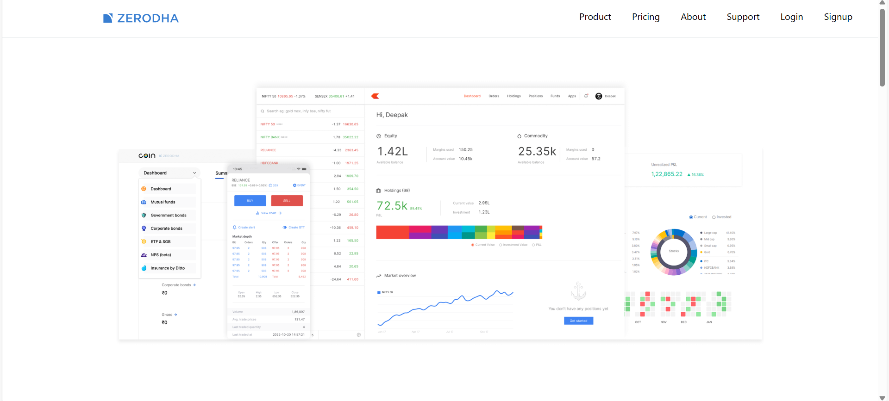
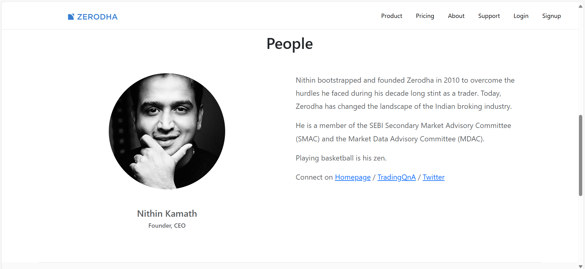
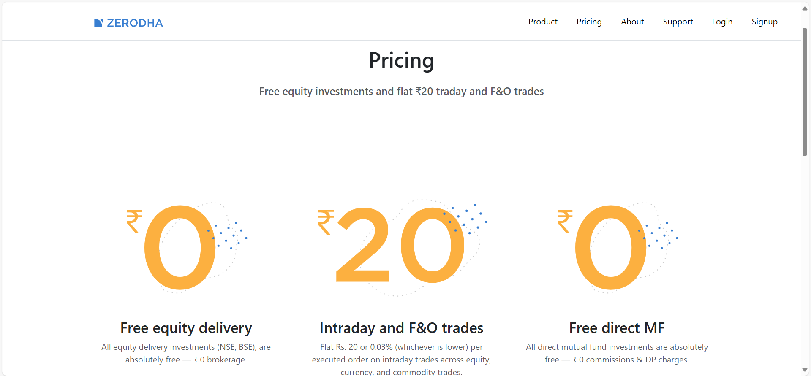
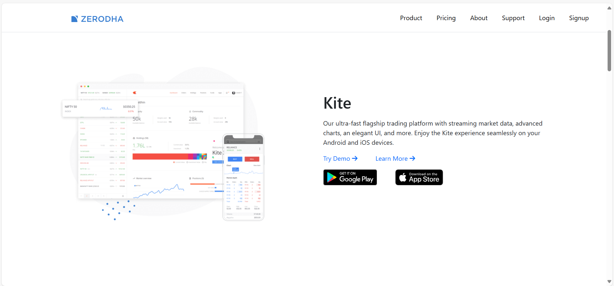
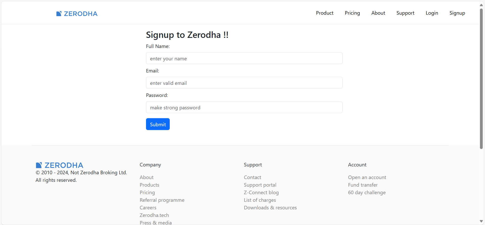
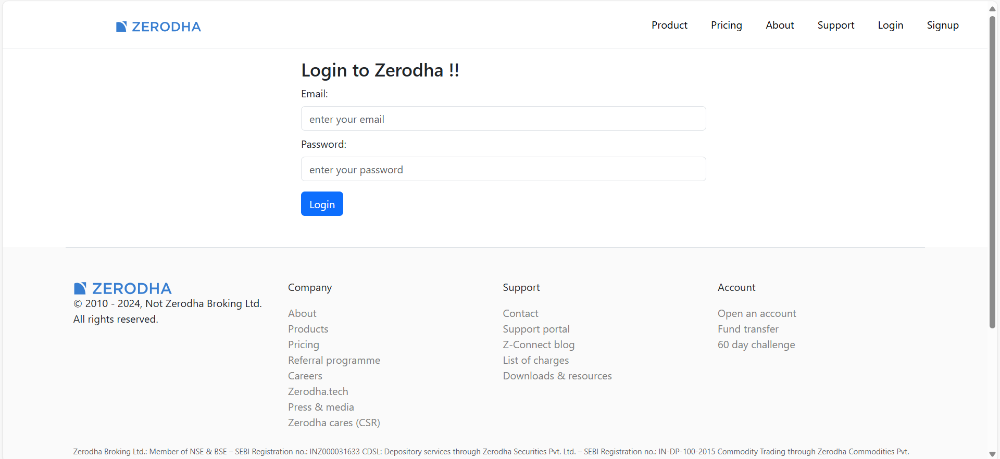

# zerodha_clone
# 📈 Zerodha Clone (Frontend Only)

This is a **frontend-only clone** of [Zerodha](https://zerodha.com/) built using **React + Vite**, **HTML**, and **pure CSS**. The project includes static pages like the homepage, about, pricing, signup, login, and product. It replicates the layout and styling of Zerodha's official site for educational and practice purposes.

---

## 🚀 Features

- ⚛️ React + Vite for fast development
- 🎨 Pure CSS for styling (no frameworks)
- 🌐 Client-side routing with `react-router-dom`
- 📱 Fully responsive and mobile-friendly
- 🔧 Modular and clean code structure

---

## 🧭 Routes & Pages

| Path        | Description              |
|-------------|--------------------------|
| `/`         | Homepage                 |
| `/about`    | About Zerodha            |
| `/pricing`  | Pricing details          |
| `/signup`   | Create a Zerodha account |
| `/login`    | Login page               |
| `/product`  | Zerodha product info     |

---

## 🖼️ Screenshots

| Homepage | About | Pricing |
|----------|-------|---------|
|  |  |  |

| Product | Signup | Login |
|--------|--------|-------|
|  |  |  |

> 💡 You can upload screenshots to [Imgur](https://imgur.com/) or GitHub and paste the links here.

---

## 🛠️ Tech Stack

- **React** (with Vite)
- **JavaScript**
- **HTML**
- **CSS**
- **React Router DOM** (for page navigation)

---

## 📦 Getting Started (Local Setup)

Follow these steps to run the project locally:

```bash
# 1. Clone the repository
git clone https://github.com/rakesh-choudhary-01/zerodha_clone.git
cd zerodha-clone

# 2. Install dependencies
npm install

# 3. Start the development server
npm run dev
